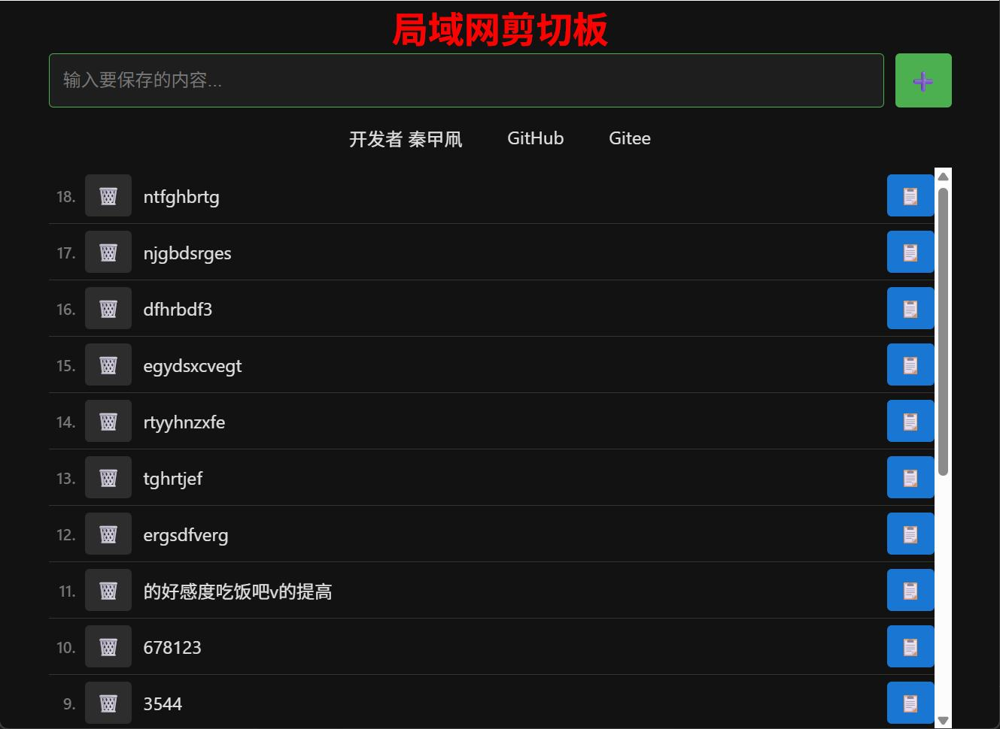
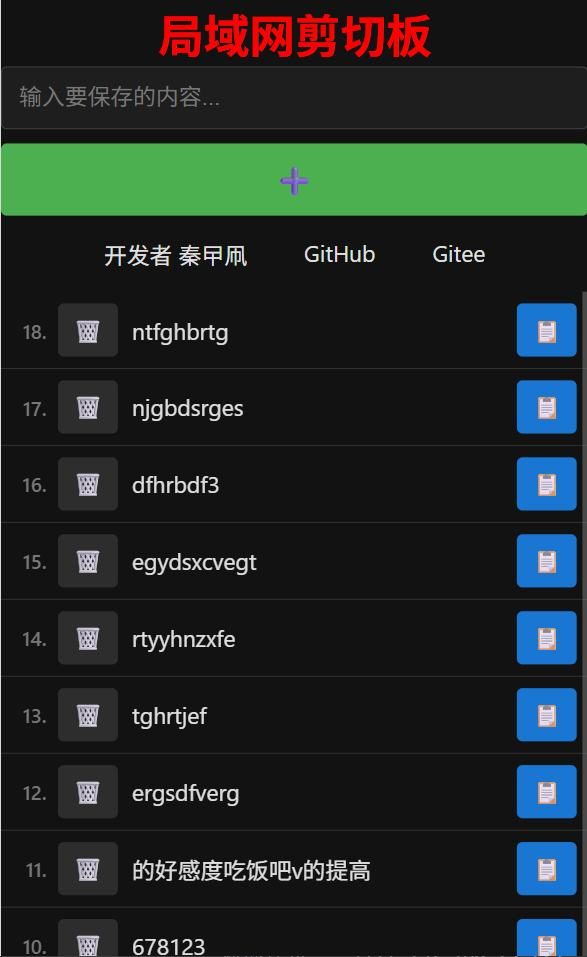

# 局域网剪切板

一个简单高效的局域网内实时同步剪切板工具，让多设备之间的内容共享变得简单。

欢迎关注我B站账号 [秦曱凧](https://space.bilibili.com/17547201) (读作 qín yuē zhēng)

- 原项仓库
  - GitHub仓库 https://github.com/Firfr/jian_qie_ban
  - Gitee仓库 https://gitee.com/firfe/jian_qie_ban

有需要帮忙部署这个项目的朋友,一杯奶茶,即可程远程帮你部署，需要可联系。  
微信号 `E-0_0-`  
闲鱼搜索用户 `明月人间`  
或者邮箱 `firfe163@163.com`  
如果这个项目有帮到你。欢迎start。也可以打赏一下。

## 效果图

| 电脑 | 手机 |
|:-:|:-:|
|  |  |


## 功能特点

- 📝 **实时同步**：在一个设备上输入的内容，会立即同步到所有其他打开页面的设备
- 📱 **跨设备支持**：支持电脑、手机等各种设备的浏览器访问
- 🗑️ **内容管理**：支持删除不需要的内容
- 📋 **一键复制**：点击即可将内容复制到剪切板
- 🌙 **黑暗模式**：支持明暗主题切换，保护眼睛
- 🔄 **自动刷新**：开发模式下，代码变更后自动刷新页面
- ⚠️ **断开提示**：当与浏览器断开连接时，标题文字会颜色变为红色

## 技术栈

- **运行时**：Bun 1.3.1+
- **框架**：Express
- **实时通信**：WebSocket (ws)

## 本地安装与启动

### 前置要求

- Bun 1.3.1
- 使用docker
  ```bash
  docker run --rm -it --name Node_Code --restart=no \
  --cpus=1 --memory=2G --network host \
  -w /app -v ./:/app oven/bun:1.3.1-alpine ash
  ```

### 安装步骤

1. 克隆或下载项目代码

2. 安装依赖：
   ```bash
   bun install
   ```

### 启动方式

- 运行开发模式：
  - 使用 Bun 热重载启动，支持代码变更自动重启服务器并刷新浏览器：
  ```bash
  bun run dev
  ```
- 运行生产模式：
  ```bash
  bun run start
  ```

### Docker镜像构建

AMD64镜像：
```bash
docker buildx build --platform linux/amd64 --tag firfe/jian_qie_ban:1.0 --load .
```
ARM64镜像：
```bash
docker buildx build --platform linux/arm64 --tag firfe/jian_qie_ban:1.0-arm64 --load .
```

## 使用Docker运行

从阿里云或华为云镜像仓库拉取镜像，注意填写镜像标签，镜像仓库中没有`latest`标签

容器内部端口`5159`，可通过设置环境变量`PORT`的值来指定监听端口。

- 国内仓库
  - AMD64镜像
    ```bash
    swr.cn-north-4.myhuaweicloud.com/firfe/jian_qie_ban:1.0
    ```
  - ARM64镜像
    ```bash
    swr.cn-north-4.myhuaweicloud.com/firfe/jian_qie_ban:1.0-arm64
    ```
- DockerHub仓库
  - AMD64镜像
    ```bash
    firfe/jian_qie_ban:1.0
    ```
  - ARM64镜像
    ```bash
    firfe/jian_qie_ban:1.0-arm64
    ```

### docker run 命令部署

```bash
docker run -d \
--name jian_qie_ban \
--network bridge \
--restart always \
--log-opt max-size=1m \
--log-opt max-file=1 \
-p 5159:5159 \
firfe/jian_qie_ban:1.0
```

### compose 文件部署 👍推荐

```yaml
# version: '3'
name: jian_qie_ban
services:
  jian_qie_ban:
    container_name: jian_qie_ban
    image: firfe/jian_qie_ban:1.0
    restart: always
    logging:
      options:
        max-size: 1m
        max-file: '1'
    ports:
      - 5159:5159
    volumes:
      - ./data:/data
```

## 环境变量配置

项目支持以下环境变量来配置功能。

| 环境变量名 | 说明 | 默认值 | 示例 |
|---------|------|-------|------|
| `PORT` | 服务器端口 | 5159 | `PORT=8080` |
| `MAX_ITEMS` | 最大保存的内容条数 | 1000 | `MAX_ITEMS=500` |
| `MAX_AGE` | 内容最长保存时间（小时） | null（不限） | `MAX_AGE=24` |
| `WRITE_INTERVAL` | 数据写入文件的间隔时间（分钟） | 10 | `WRITE_INTERVAL=5` |
| `NODE_ENV` | 运行环境（production/development） | development | `NODE_ENV=production` |
| `MAX_CHANGES` | 累积变更数达到阈值时写入（IO优化） | 10 | `MAX_CHANGES=20` |
| `MIN_INTERVAL` | 最小写入间隔（毫秒）（IO优化） | 30000 | `MIN_INTERVAL=60000` |
| `FORCE_WRITE` | 所有连接关闭时是否强制写入 | true | `FORCE_WRITE=false` |

## 使用说明

1. 启动服务器后，控制台会显示访问地址（通常是 `http://服务器IP:5159`）

2. 在浏览器中打开显示的地址

3. 在顶部输入框中输入内容，点击「保存」按钮

4. 内容会显示在输入框下方，所有打开同一页面的设备都会同步看到

5. 功能按钮：
   - 🗑️ 删除按钮：删除对应内容
   - 📋 复制按钮：将内容复制到剪切板

6. 点击页面标题「局域网剪切板」可以切换明暗主题


## 数据存储

- 所有内容以纯文本形式存储在 `./data/剪切板内容.txt` 文件中，docker中在`/data/剪切板内容.txt`
- 文件格式：`添加时间 添加设备IP 具体内容`
- 服务器关闭时会自动保存所有未写入的数据
- 所有连接关闭时可选择自动写入数据（可通过环境变量配置）

## 注意事项

- 仅为局域网内使用开发，没有账号认证
- 请在安全的局域网环境中使用
- 内容存储在服务器端的文本文件中，请确保服务器有足够的存储空间
- 使用Docker时，确保挂载的卷具有正确的读写权限，挂载到容器的 `/data` 目录

## 开发说明

- 使用 `bun run dev` 启动开发模式，代码变更后会通过Bun的热重载功能自动重启服务器并刷新浏览器
- 开发模式下会监控 HTML、CSS、JS 文件的变化
- 所有功能操作都会在服务器控制台输出日志信息
- 项目同时兼容Bun和Node.js环境，可根据个人喜好选择运行时

